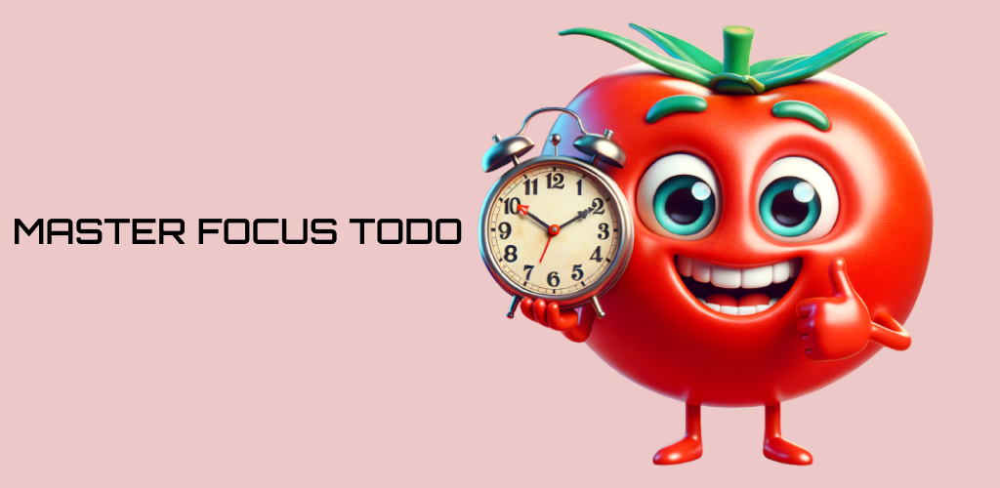

# Master Focus To-do

[📲 LINK do App Play Store](https://play.google.com/store/apps/details?id=com.hdmtecnologia.master_focus_todo&pcampaignid=web_share)

Este é um aplicativo para você manter o foco nas tarefas, sejam elas estudos, tarefas de casa
ou do trabalho, importante é não perder o objetivo de vista 😊.

Seguindo a técnica do Pomodoro onde você mantém 25 minutos de foco intenso e 5 minutos para descanso,
este aplicativo se baseia nisso para fazer com que você possa atingir o seu mais alto nível de concentração.

Este aplicativo é totalmente gratuito, bom foco 💪.

### Como foi desenvolvido

- 🚀 Desenvolvido com Flutter
- 🎨 Design intuitivo e moderno
- 📈 Monitoramento de progresso

### Funcionalidades

- ⏲️ Temporizador Pomodoro
- 📋 Lista de tarefas
- 📊 Relatórios de desempenho

Bom foco e boa produtividade! 🚀

---

### Libs utilizadas

As bibliotecas utilizadas para compor este projeto são as seguintes

- intl: Para conversão de datas e internacionalização
- shared_preferences: Para armazenamento de dados no telefone usando chave/valor
- flutter_svg: Carregamento de imagens em SVG
- provider: Para injeção de dependência combinando também gerencia de estado global
- uuid: Para chaves de identificação única
- path: Para formatação de caminhos
- audioplayers: Para tocar sons entre as tarefas
- google_fonts: Para incrementar as fontes a serem utilizadas no app
- google_sign_in: Para autenticação
- firebase_core: Uso do firebase
- firebase_auth: Utilizando pacote de autenticação do firebase
- sqlite: Para armazenamento de dados utilizando o sqlite
- path_provider: Obter o diretorio disponivel para a aplicação.
- flutter_localizations: Para internacionalização
- auto_size_text: Redimensionamento automático de texto
- flutter_native_splash: Para criar uma splash screen a sere exibida
- vibration: Para acionar a vibração do celular, utilizado entre as tarefas
- package_info_plus: Para obter a versão do aplicativo e exibi-la na tela

### 📁 **Estrutura do projeto**

A estrutura do projeto consiste em organização de pastas com arquivos que têm funções específicas no código.
O padrão Repository foi utilizado neste projeto para permitir mais flexibilidade na hora de mudar a fonte de dados,
com isso não impactando na lógica de negócios e nem na interface gráfica. As pastas são organizadas da seguinte forma:

- **controller**: A lógica de negócio do aplicativo vive aqui, assim como o controle de estado e acesso aos dados (Repositórios)
- **database**: Contém classes que contêm queries para atividades nas tabelas, como criar, editar, excluir e também contém uma função para acesso ao banco SQLITE
- **models**: Classes modelos para serem usadas em toda a aplicação, classes base como a TodoTask e TodoTimer
- **repository**: Interfaces e implementações para acesso aos dados residem aqui, se uma nova fonte de dados deve ser inserida, implemente uma das interfaces.
- **screens**: As telas do aplicativo residem aqui
- **theme**: Tem os temas dark e light assim como configurações padrão para certos componentes
- **utils**: Tudo que não tem uma classificação definida fica aqui, conversores de data, classes informativas do pacote entre outras.
- **widgets**: Pasta que contém todos os widgets utilizados na aplicação.
- **constants**: Arquivos que contêm caminhos para assets ou nomes de recursos que não mudam e são utilizados em toda a aplicação
